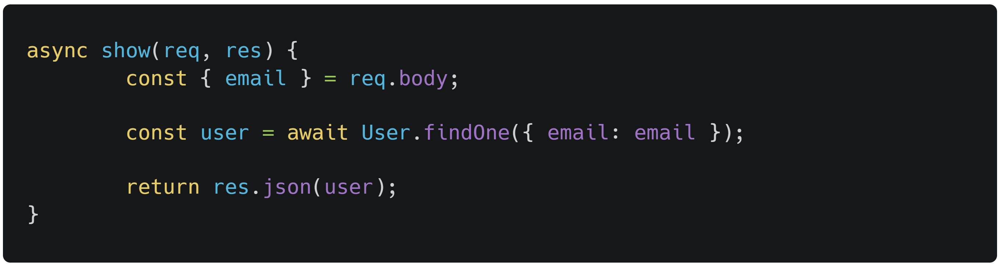

# Lista de vulnerabilidades

## vulnerabilidade 01

<section>
    
 

*src/app/controllers/UserController.js*

 
    

A6:2017 - Segurança e Gerenciamento de Configuração.

    

A razão é que o código está expondo informações sensíveis do usuário sem qualquer controle de acesso ou verificação de autenticação. Qualquer pessoa que possa fazer uma solicitação ao endpoint associado a essa função poderia potencialmente obter informações sobre um usuário apenas fornecendo um endereço de e-mail.

</section>

